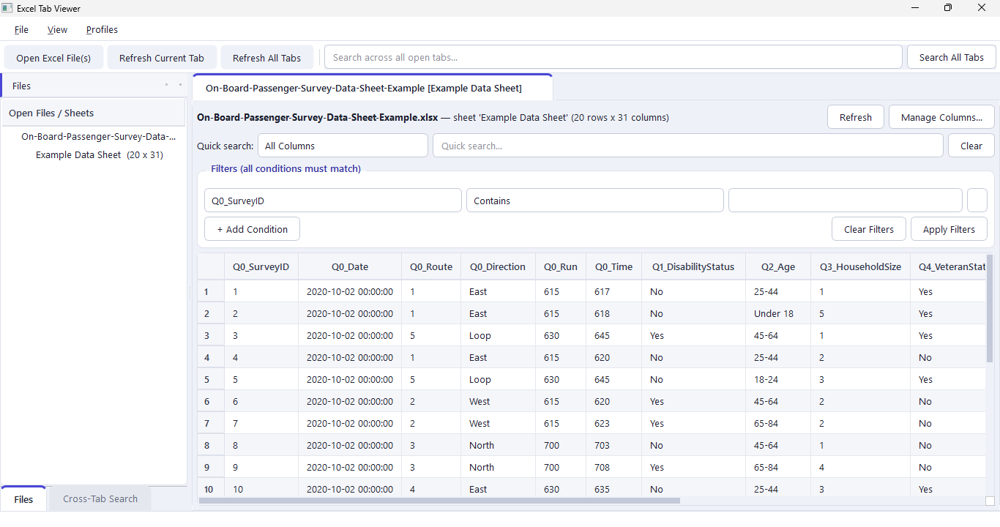

# Excel Tab Viewer

A Windows desktop app for viewing, filtering, and comparing multiple Excel
files side by side — each file (and each sheet) opens in its own tab, with
independent search/filtering per tab, instead of juggling several Excel
windows and re-applying filters in each one.

Built with Python, [PySide6](https://doc.qt.io/qtforpython-6/), and
[pandas](https://pandas.pydata.org/).



## Features

- **Multi-file, multi-sheet tabs** — open several workbooks (and several
  sheets from the same workbook) at once, each in its own independent tab.
- **Per-tab filtering** — multi-column AND filters (contains, equals,
  ranges, is empty/not empty) plus a quick single-column or all-columns
  search, with `*`/`?` wildcard support (Excel/Access-style).
- **Cross-tab search** — search every open tab at once and jump straight to
  a matching row, wherever it is.
- **Column visibility** — show/hide columns per tab without touching the
  underlying data.
- **Header-row picker** — for files where the real header isn't row 1
  (title rows, blank rows above it), preview the sheet and pick the correct
  header row.
- **Row detail view** — double-click any row to see it as a readable
  vertical field list, useful for wide records or cells with embedded line
  breaks.
- **Cell preview & copy** — View ▸ Cell Preview (F3) shows the selected
  cell's full value, however long; Ctrl+C (or right-click ▸ Copy) copies
  selected cells as text that pastes straight into Excel.
- **Faithful values** — text cells are shown exactly as typed in Excel
  (`0044`, `+44…` phone numbers, `N/A` stay as they are).
- **Refresh** — reload any tab (or all tabs) from disk if the source file
  changed, re-applying your filters and column choices.
- **Profiles** — save the exact set of open files, sheets, columns, and
  filters under a name, and reopen that whole setup in one click. Handles
  moved/renamed source files by prompting you to relocate them.
- **Packaged as a standalone Windows `.exe`** — no Python install required
  for end users (see [Building the `.exe`](#building-the-exe) below).

## Requirements

- Windows 10/11 (target platform; the code itself is cross-platform PySide6)
- Python 3.11+ if running from source

## Running from source

```powershell
git clone <your-repo-url>
cd excel-tab-viewer
python -m venv venv
venv\Scripts\activate
pip install -r requirements.txt
python main.py
```

## Building the `.exe`

Full walkthrough (hidden-import gotchas, one-dir vs one-file, icon setup,
antivirus/SmartScreen notes) is in [`PACKAGING.md`](PACKAGING.md). Short
version:

```powershell
pip install -r requirements.txt   # already includes pyinstaller
pyinstaller excel_tab_viewer.spec
```

Output lands in `dist/ExcelTabViewer/` — ship that whole folder (or a zip
of it), not just the `.exe` alone.

## Project structure

```
excel-tab-viewer/
├── main.py                    # entry point
├── excel_tab_viewer.spec      # PyInstaller build config
├── requirements.txt
├── PACKAGING.md                # how to build the .exe
├── ui/                          # windows, dialogs, tab/filter widgets
├── models/                      # the pandas-backed Qt table model
├── core/                        # Excel loading, filter logic, profile storage
└── resources/                   # stylesheet + icons
```

## License

See [`LICENSE`](LICENSE).
